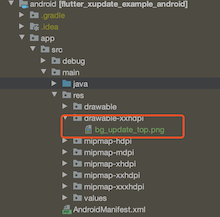

# flutter_xupdate

[](https://pub.dev/packages/flutter_xupdate)
[](https://travis-ci.org/xuexiangjys/flutter_xupdate)
[](https://github.com/xuexiangjys/flutter_xupdate/issues)
[](https://github.com/xuexiangjys/flutter_xupdate)

A Flutter plugin for [XUpdate](https://github.com/xuexiangjys/XUpdate) -- Android Update Library。See the use [Chinese Document](https://github.com/xuexiangjys/flutter_xupdate/wiki) for details。

## Video tutorial

[How to use flutter_xupdate](https://www.bilibili.com/video/BV1YK4y1S73e)

## Getting Started

You should ensure that you add the `flutter_xupdate` as a dependency in your flutter project.

```
// pub 集成
dependencies:
  flutter_xupdate: ^2.0.0

//github  集成
dependencies:
  flutter_xupdate:
    git:
      url: git://github.com/xuexiangjys/flutter_xupdate.git
      ref: master
```

## Setting up

Modify the Main App Theme to AppCompat，For example:

```
<resources>
    <style name="LaunchTheme" parent="Theme.AppCompat.Light.NoActionBar">
        <item name="android:windowBackground">@drawable/launch_background</item>
    </style>
</resources>
```

## UseCase

### Initialization

```
  ///初始化
   void initXUpdate() {
     if (Platform.isAndroid) {
       FlutterXUpdate.init(
         ///是否输出日志
         debug: true,
         ///是否使用post请求
         isPost: false,
         ///post请求是否是上传json
         isPostJson: false,
         ///请求响应超时时间
         timeout: 25000,
         ///是否开启自动模式
         isWifiOnly: false,
         ///是否开启自动模式
         isAutoMode: false,
         ///需要设置的公共参数
         supportSilentInstall: false,
         ///在下载过程中，如果点击了取消的话，是否弹出切换下载方式的重试提示弹窗
         enableRetry: false
       ).then((value) {
         updateMessage("初始化成功: $value");
       }).catchError((error) {
         print(error);
       });

       FlutterXUpdate.setErrorHandler(
           onUpdateError: (Map<String, dynamic> message) async {
         print(message);
         setState(() {
           _message = "$message";
         });
       });
     } else {
       updateMessage("ios暂不支持XUpdate更新");
     }
   }

```

### JSON Format

```
{
  "Code": 0, //0代表请求成功，非0代表失败
  "Msg": "", //请求出错的信息
  "UpdateStatus": 1, //0代表不更新，1代表有版本更新，不需要强制升级，2代表有版本更新，需要强制升级
  "VersionCode": 3,
  "VersionName": "1.0.2",
  "ModifyContent": "1、优化api接口。\r\n2、添加使用demo演示。\r\n3、新增自定义更新服务API接口。\r\n4、优化更新提示界面。",
  "DownloadUrl": "https://raw.githubusercontent.com/xuexiangjys/XUpdate/master/apk/xupdate_demo_1.0.2.apk",
  "ApkSize": 2048
  "ApkMd5": "..."  //md5值没有的话，就无法保证apk是否完整，每次都会重新下载。框架默认使用的是md5加密。
}
```

### CheckUpdate

```
  ///默认App更新
  void checkUpdateDefault() {
    FlutterXUpdate.checkUpdate(url: _updateUrl);
  }

  ///默认App更新 + 支持后台更新
  void checkUpdateSupportBackground() {
    FlutterXUpdate.checkUpdate(url: _updateUrl, supportBackgroundUpdate: true);
  }

  ///调整宽高比
  void checkUpdateRatio() {
    FlutterXUpdate.checkUpdate(url: _updateUrl, widthRatio: 0.6);
  }

  ///强制更新
  void checkUpdateForce() {
    FlutterXUpdate.checkUpdate(url: mUpdateUrl2);
  }

  ///自动模式, 如果需要完全无人干预，自动更新，需要root权限【静默安装需要】
  void checkUpdateAutoMode() {
    FlutterXUpdate.checkUpdate(url: _updateUrl, isAutoMode: true);
  }

  ///下载时点击取消允许切换下载方式
  void enableChangeDownLoadType() {
    FlutterXUpdate.checkUpdate(
      url: _updateUrl,
      overrideGlobalRetryStrategy: true,
      enableRetry: true,
      retryContent: "Github下载速度太慢了，是否考虑切换蒲公英下载？",
      retryUrl: "https://www.pgyer.com/flutter_learn");
  }
```


### Custom JSON Format

1.Setting up a custom update parser

```
FlutterXUpdate.setCustomParseHandler(onUpdateParse: (String json) async {
//Here is the custom JSON parsing
return customParseJson(json);
});

///Resolve the custom JSON content to the UpdateEntity entity class
UpdateEntity customParseJson(String json) {
  AppInfo appInfo = AppInfo.fromJson(json);
  return UpdateEntity(
      hasUpdate: appInfo.hasUpdate,
      isIgnorable: appInfo.isIgnorable,
      versionCode: appInfo.versionCode,
      versionName: appInfo.versionName,
      updateContent: appInfo.updateLog,
      downloadUrl: appInfo.apkUrl,
      apkSize: appInfo.apkSize);
}
```

2.Set the parameter `isCustomParse` to true

```
FlutterXUpdate.checkUpdate(url: _updateUrl3, isCustomParse: true);
```

### Update By UpdateEntity Directly

```
///直接传入UpdateEntity进行更新提示
void checkUpdate8() {
    FlutterXUpdate.updateByInfo(updateEntity: customParseJson(_customJson));
}
```

### Custom Update Prompt Style

> Currently, only theme color and top picture customization are supported!

1.Configure top picture, Path: `android/app/src/main/res/values/drawable`, For example:



2.Set the parameter `themeColor` 、 `topImageRes` and `buttonTextColor`

```
///自定义更新弹窗样式
void customPromptDialog() {
    FlutterXUpdate.checkUpdate(url: _updateUrl, themeColor: '#FFFFAC5D', topImageRes: 'bg_update_top', buttonTextColor: '#FFFFFFFF');
}
```

## Property value

### Initialization

Name | Type | Default | Description
:-|:-:|:-:|:-
debug | bool | false | Whether Output log
isPost | bool | false | Whether use post request
isPostJson | bool | false | Whether post request upload json format
timeout | int | 20000(ms) | Request response timeout
isWifiOnly | bool | true | Whether update only under WiFi
isAutoMode | bool | false | Whether to turn on automatic mode
supportSilentInstall | bool | false | Whether to support silent installation requires that the device has root permission
enableRetry | bool | false | In the process of downloading, if you click Cancel, whether the pop-up window for retrying to switch the download mode will pop up
retryContent | String | '' | Try the prompt content of the prompt pop-up window again
retryUrl | String | '' | Retrying prompt pop-up URL to jump after clicking
params | Map | / | Public parameters to be set

### CheckUpdate

Name | Type | Default | Description
:-|:-:|:-:|:-
url | String | / | URL of version check
params | Map | / | Parameters
supportBackgroundUpdate | bool | false | Whether to support background updates
isAutoMode | bool | false | Whether to turn on automatic mode
isCustomParse | bool | false | Is it a custom resolution protocol
themeColor | String | '' | Apply pop-up theme color
topImageRes | String | '' | The name of the top picture resource in the pop-up window
buttonTextColor | String | '' | The color of the button text
widthRatio | double | / | Proportion of version update Prompter width to screen
heightRatio | double | / | Proportion of version update Prompter height to screen
overrideGlobalRetryStrategy | bool | false | Whether to override the global retry policy
enableRetry | bool | false | In the process of downloading, if you click Cancel, whether the pop-up window for retrying to switch the download mode will pop up
retryContent | String | '' | Try the prompt content of the prompt pop-up window again
retryUrl | String | '' | Retrying prompt pop-up URL to jump after clicking
